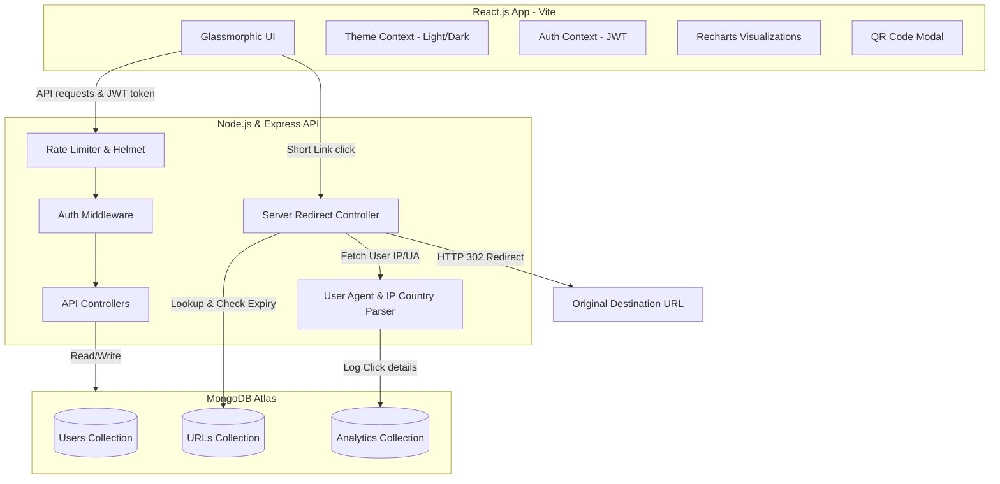

# LinkLite ⚡ - Premium URL Shortener & Analytics

LinkLite is a modern, high-fidelity SaaS-style full-stack URL Shortener and Analytics platform designed for rapid, secure, and production-ready link sharing. Built with a Glassmorphism design aesthetic, it features real-time click statistics, user agent/IP country geolocation parsing, customizable expiration policies, downloadable QR code generators, and JWT-authenticated session tracking.

---

## 🏗️ Architecture Design

Below is the conceptual architecture of LinkLite:



---

## 📁 Project Directory Structure

```text
linklite/
├── client/                 # React Frontend
│   ├── public/             # Static Assets
│   ├── src/
│   │   ├── components/     # ProtectedRoute, Layout
│   │   ├── context/        # AuthContext, ThemeContext
│   │   ├── pages/          # Login, Signup, Dashboard, Analytics, LinkExpired, NotFound
│   │   ├── App.jsx         # App routes & Toaster
│   │   ├── main.jsx        # Mount point
│   │   └── index.css       # Tailwind directives & glassmorphic custom variables
│   ├── index.html          # HTML Entry & SEO Meta Tags
│   ├── postcss.config.js   # PostCSS configuration
│   ├── tailwind.config.js  # Tailwind CSS theme mappings
│   ├── vite.config.js      # Vite dev configurations & /api proxying
│   └── package.json
│
├── server/                 # Node/Express Backend
│   ├── controllers/        # authController, urlController, analyticsController, redirectController
│   ├── middleware/         # auth (JWT validator)
│   ├── models/             # User, URL, Analytics Mongoose Schemas
│   ├── routes/             # api router mapping
│   ├── .env                # Backend Environment Variables
│   ├── server.js           # Server Core Setup
│   └── package.json
└── README.md
```

---

## 🛠️ Tech Stack & Key Libraries

### Frontend
- **React.js & Vite**: Ultra-fast hot module replacement.
- **Tailwind CSS v3**: Fully responsive styling, glassmorphism, and dark/light modes.
- **Framer Motion**: Smooth page transitions and button micro-interactions.
- **Recharts**: Beautiful SVG click timelines and browser/device donut charts.
- **React Hot Toast**: Real-time popups for errors, success events, and clipboard copying.
- **qrcode.react**: SVG-based QR code generation supporting png exports.

### Backend
- **Node.js & Express.js**: Asynchronous server framework.
- **Mongoose & MongoDB**: Object modeling for schema creation and analytics tracking.
- **JWT & bcryptjs**: Hashed passwords and secure session handling.
- **Helmet**: Secures HTTP response headers.
- **Express Rate Limit**: Protects APIs against DDOS/brute-force request spam.
- **ua-parser-js & geoip-lite**: Automatically parses device type, browser, OS, and client country.

---

## 💾 Database Schemas

### 1. User Schema
Stores authenticated platform operators.
```javascript
{
  name: { type: String, required: true },
  email: { type: String, required: true, unique: true },
  password: { type: String, required: true }, // Bcrypt-hashed
  createdAt: { type: Date, default: Date.now }
}
```

### 2. URL Schema
Stores the mapping of destinations to short codes.
```javascript
{
  userId: { type: mongoose.Schema.Types.ObjectId, ref: 'User', default: null },
  originalUrl: { type: String, required: true },
  shortCode: { type: String, required: true, unique: true },
  customAlias: { type: String, unique: true, sparse: true },
  shortUrl: { type: String, required: true },
  clicks: { type: Number, default: 0 },
  expiryDate: { type: Date, default: null },
  createdAt: { type: Date, default: Date.now }
}
```

### 3. Analytics Schema
Captures analytical details of every click redirect.
```javascript
{
  urlId: { type: mongoose.Schema.Types.ObjectId, ref: 'URL', required: true },
  timestamp: { type: Date, default: Date.now },
  browser: { type: String, default: 'Unknown' },
  device: { type: String, default: 'Desktop' },
  os: { type: String, default: 'Unknown' },
  ipAddress: { type: String, default: 'Unknown' },
  country: { type: String, default: 'Unknown' }
}
```

---

## ⚡ REST APIs

### 🔐 Authentication Module
- `POST /api/auth/register`: Register user credentials. Returns JWT session token.
- `POST /api/auth/login`: Validate user credentials. Returns JWT session token.
- `GET /api/user/profile`: Retrieve profile details of authenticated user. [Protected Route]

### 🔗 URL Shortening & Operations
- `POST /api/url/create`: Shorten long destination, configure aliases, or define expiry dates. [Protected Route]
- `GET /api/url/all`: List all created URLs for authenticated user. [Protected Route]
- `PUT /api/url/update/:id`: Update original destination, custom alias, or expiry date of an active link. [Protected Route]
- `DELETE /api/url/delete/:id`: Delete shortened link and purge its analytics logs. [Protected Route]

### 📊 Analytics Reports
- `GET /api/analytics/:id`: Extract click aggregates, timelines, and recent client details. [Protected Route]

### 🔀 Server Redirect
- `GET /:shortCode`: Public server-side redirect path. Updates analytics counters and redirects client (HTTP 302) to target.

---

## ⚙️ Environment Variables Configuration

Create a file named `.env` in the `/server` directory and add the following keys:

```ini
PORT=5000
MONGODB_URI=mongodb://127.0.0.1:27017/linklite
# Use a strong custom phrase for token signing:
JWT_SECRET=linklite_super_secret_jwt_key_hackathon_winner
NODE_ENV=development
```

---

## 🚀 Setup & Execution Guide

### Prerequisites
- Node.js (v18 or higher)
- npm (v9 or higher)
- MongoDB running locally on port `27017` OR a MongoDB Atlas connection string.

### 🔌 Running locally

#### Step 1: Clone the repository and configure the Server
```bash
# Navigate to the server folder
cd server

# Install dependecies
npm install

# Start the Express server in development mode (with nodemon auto-restart)
npm run dev
```
The server will boot up and connect to MongoDB. It prints:
`Successfully connected to MongoDB.`
`Server is running on port 5000`

#### Step 2: Configure and Run the Client
Open a new terminal window in the root of the workspace.
```bash
# Navigate to the client folder
cd client

# Install dependecies
npm install --legacy-peer-deps

# Start the Vite React development server
npm run dev
```
The client will start running locally at:
`http://localhost:5173/`

Vite handles routing API calls under `/api` to the backend on `http://localhost:5000` via Vite's proxy configurations.

---

## 🌐 Production Deployment Guide

To deploy the application for production:

### Backend Deployment (Render / Railway / Heroku)
1. Push the repository to GitHub.
2. In your deployment dashboard (e.g., Render), create a new **Web Service**.
3. Point the web service to the `server/` subdirectory.
4. Set the build command to `npm install` and startup command to `node server.js` or `npm start`.
5. In the **Environment Variables** configuration, set:
   - `MONGODB_URI`: Your production MongoDB Atlas Connection String.
   - `JWT_SECRET`: A secure long random string.
   - `NODE_ENV`: `production`.
   - `PORT`: `5000` (or leave empty if automatically assigned).
6. Copy the deployed backend URL (e.g., `https://linklite-api.onrender.com`).

### Frontend Deployment (Vercel / Netlify / Cloudflare Pages)
1. Create a new **Project** on Vercel.
2. Link the repository and set the root directory to `client`.
3. Vercel automatically detects Vite. Set the build command to `npm run build` and output folder to `dist`.
4. Define your backend routing:
   Since Vite proxy is for local development, for production requests, configure the API target base. In Vercel, you can use a custom configuration file `vercel.json` to route `/api` to your backend URL:
   ```json
Screenshots


YoutubeLink : https://youtu.be/z2OrcSKkZh8?si=eIFekHCKbGR0GbLF


   {
     "rewrites": [
       { "source": "/api/(.*)", "destination": "https://linklite-api.onrender.com/api/$1" }
     ]
   }
   ```
5. Deploy. You're now live!
